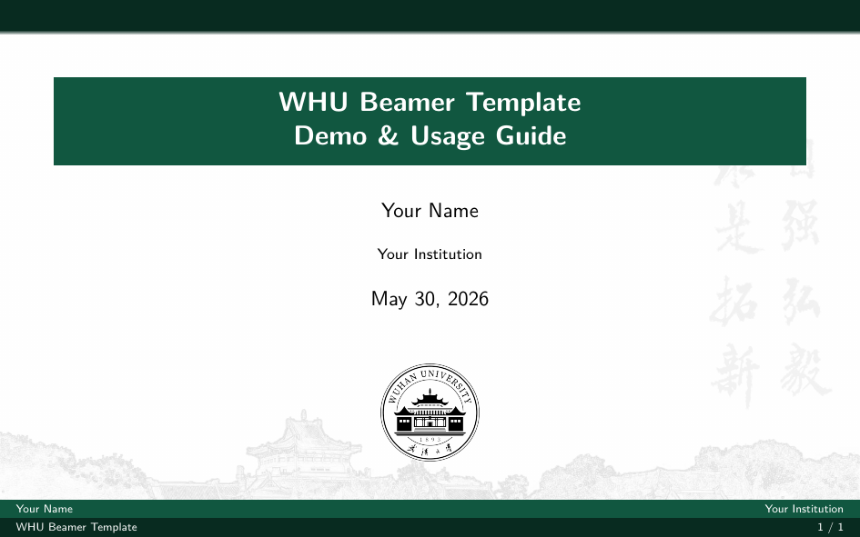
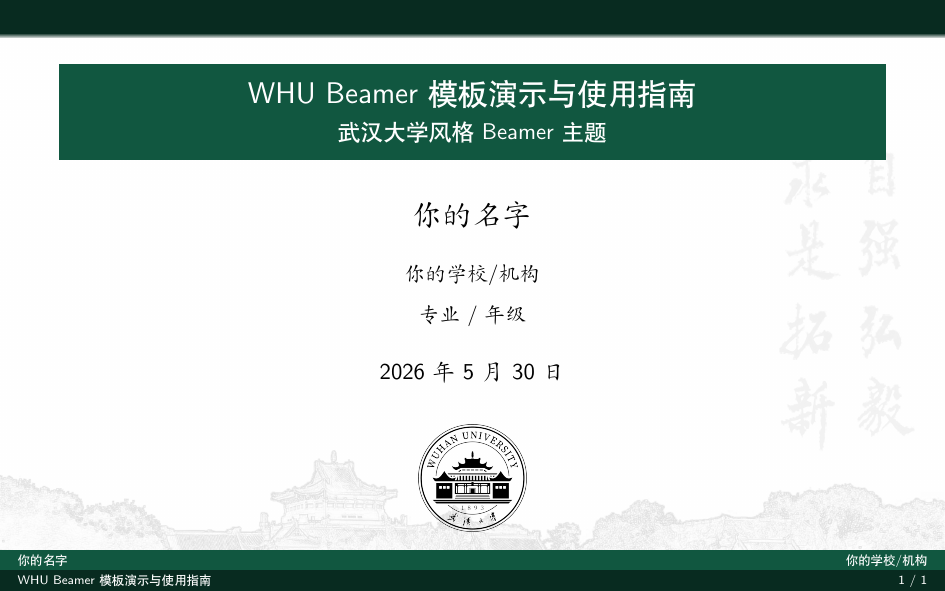
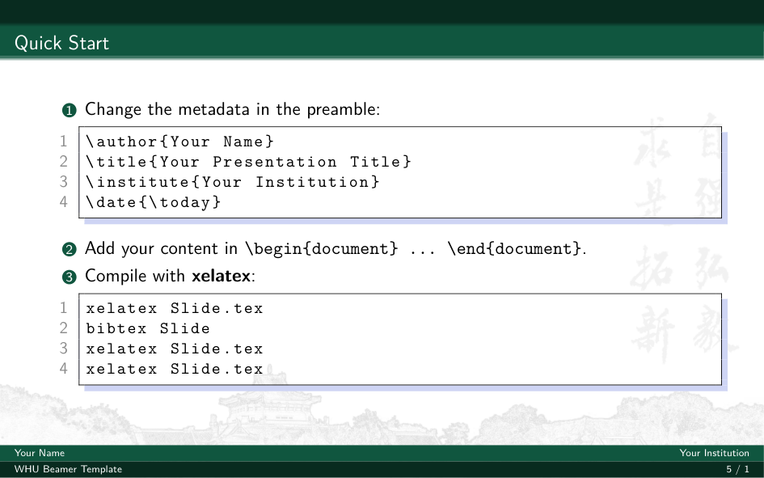
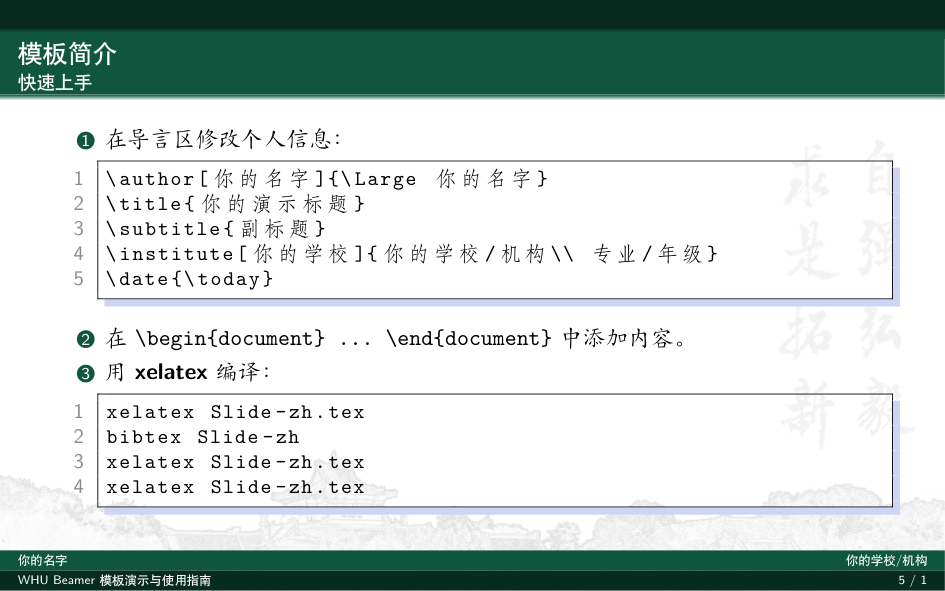

# WHU Beamer Template

[](LICENSE)

武汉大学 (WHU) 风格的学术演示 Beamer 模板，提供**英文**和**中文**两个版本。

A Wuhan University (WHU) themed Beamer template for academic presentations. Both **English** and **Chinese** versions are provided.

## Preview / 预览

### Title Pages / 标题页

| English | Chinese |
|---|---|
|  |  |

### Content Demo / 内容演示

| English | Chinese |
|---|---|
|  |  |

## Quick Start / 快速开始

### English Version

```bash
xelatex Slide.tex
bibtex Slide
xelatex Slide.tex
xelatex Slide.tex
```

### Chinese Version / 中文版

```bash
xelatex Slide-zh.tex
bibtex Slide-zh
xelatex Slide-zh.tex
xelatex Slide-zh.tex
```

## Dependencies / 依赖

- **TeX Live** (full installation recommended)
- Chinese version requires `ctex` + `fandol` fontset (or your preferred `ctex` fontset)

## Customization / 自定义

### Basic Info / 基本信息

Edit the metadata in `Slide.tex` or `Slide-zh.tex`:

```latex
\author{Your Name}
\title{Your Presentation Title}
\subtitle{Optional Subtitle}
\institute{Your Institution}
\date{\today}
```

### Aspect Ratio / 屏幕比例

Change the document class option:

```latex
\documentclass[aspectratio=1610]{beamer}  % 16:10 (default)
\documentclass[aspectratio=169]{beamer}   % 16:9
```

Update the background image accordingly in the preamble. Background images for both ratios are provided in `images/`.

### Background Images / 背景图片

```latex
% For 16:10
\setbeamertemplate{background}{\includegraphics[width=\paperwidth,height=\paperheight]{images/background_1610.png}}

% For 16:9
\setbeamertemplate{background}{\includegraphics[width=\paperwidth,height=\paperheight]{images/background_169.png}}
```

### Remove `handout` mode / 去掉 handout 模式

Remove `handout` from the document class options to enable overlay animations:

```latex
\documentclass[aspectratio=1610]{beamer}  % without handout
```

## Structure / 文件结构

```
WHU-Beamer-Template/
├── Slide.tex              # English template demo / 英文模板
├── Slide-zh.tex           # Chinese template demo / 中文模板
├── whu.sty                # WHU Beamer style file / 样式文件
├── ref.bib                # Example bibliography / 示例参考文献
├── images/                # Background images & WHU logos / 背景图片和校徽
│   ├── background_1610.png
│   ├── background_169.png
│   ├── background_cover_1610.png
│   ├── background_cover_169.png
│   └── whulogo*.png/eps
├── pic/                   # Demo images & logos / 演示图片
│   ├── demo.png
│   └── whulogo*.png/jpg
├── README.md
└── LICENSE
```

## Credits / 致谢

This template is modified from the following projects. Special thanks to the original authors.

本模板修改自以下项目，特此感谢原作者：

- **[xinchen13/WHU-Beamer-Theme](https://github.com/xinchen13/WHU-Beamer-Theme)** — The original WHU Beamer theme
- **[hrtan99/WHU-Beamer](https://github.com/hrtan99/WHU-Beamer)** — Background images and extended theme features

Both upstream projects are licensed under LPPL-1.3c.

## License / 许可

This project is licensed under the **LaTeX Project Public License v1.3c (LPPL-1.3c)**.

See the [LICENSE](LICENSE) file for details.
